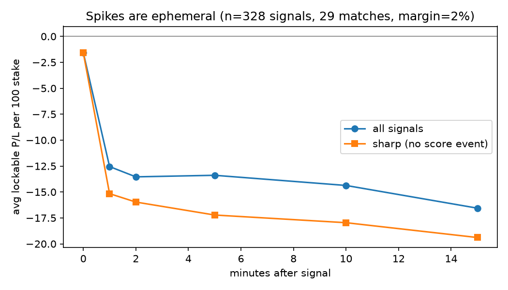
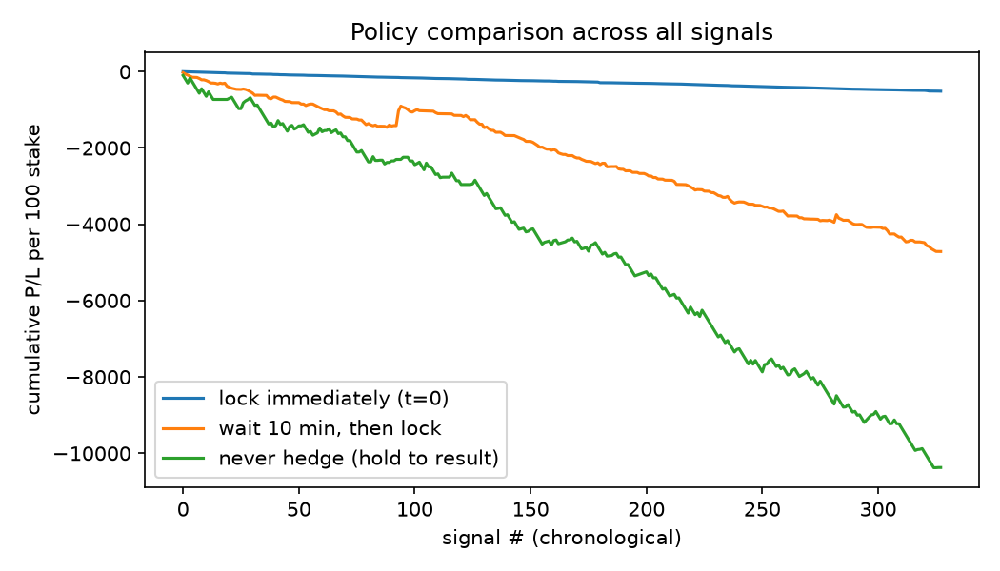

# Canonical Backtest Results

Reproduce: `python -m lineguard.results --data data/ --output results/ --margin 0.02`

**Sample:** 29 matches · 2,876,085 raw odds rows · 176,286 deduped 1X2 updates · 328 signals (220 sharp / 108 event-driven) · conservative fill margin 2% on hedge legs

P/L metric: lockable P/L `F_lock = S(a·q_i − 1)` per 100 stake. Full methodology in `backtest_summary.json`.

### All signals

| metric | n | mean | median | std | 95% CI |
|---|---|---|---|---|---|
| lock_immediate | 328 | -1.56 | -1.63 | 1.54 | [-1.73, -1.40] |
| lock_60s | 328 | -12.55 | -2.00 | 18.80 | [-14.58, -10.51] |
| lock_120s | 328 | -13.54 | -2.12 | 20.68 | [-15.78, -11.30] |
| lock_300s | 328 | -13.39 | -3.03 | 30.86 | [-16.73, -10.05] |
| lock_600s | 328 | -14.37 | -3.79 | 35.86 | [-18.25, -10.49] |
| lock_900s | 328 | -16.56 | -14.03 | 32.96 | [-20.12, -12.99] |
| unhedged_terminal | 297 | -34.92 | -100.00 | 78.60 | [-43.86, -25.98] |
| hit_rate | 297 | 44.4% (132/297) | | | |

### Sharp only (no score event within 120s)

| metric | n | mean | median | std | 95% CI |
|---|---|---|---|---|---|
| lock_immediate | 220 | -1.57 | -1.75 | 0.81 | [-1.68, -1.47] |
| lock_60s | 220 | -15.16 | -2.19 | 17.28 | [-17.45, -12.88] |
| lock_120s | 220 | -15.97 | -2.61 | 16.94 | [-18.21, -13.74] |
| lock_300s | 220 | -17.22 | -3.85 | 17.43 | [-19.52, -14.91] |
| lock_600s | 220 | -17.96 | -22.41 | 17.57 | [-20.28, -15.63] |
| lock_900s | 220 | -19.39 | -23.89 | 17.46 | [-21.70, -17.08] |
| unhedged_terminal | 205 | -38.14 | -100.00 | 80.63 | [-49.18, -27.10] |
| hit_rate | 205 | 40.0% (82/205) | | | |

### Event-driven

| metric | n | mean | median | std | 95% CI |
|---|---|---|---|---|---|
| lock_immediate | 108 | -1.54 | -0.75 | 2.41 | [-2.00, -1.09] |
| lock_60s | 108 | -7.22 | -0.96 | 20.58 | [-11.10, -3.34] |
| lock_120s | 108 | -8.59 | -1.17 | 26.04 | [-13.50, -3.68] |
| lock_300s | 108 | -5.59 | -0.88 | 46.72 | [-14.41, +3.22] |
| lock_600s | 108 | -7.07 | -0.12 | 56.53 | [-17.73, +3.59] |
| lock_900s | 108 | -10.78 | -0.58 | 51.26 | [-20.44, -1.11] |
| unhedged_terminal | 92 | -27.77 | +3.35 | 73.38 | [-42.76, -12.77] |
| hit_rate | 92 | 54.3% (50/92) | | | |

